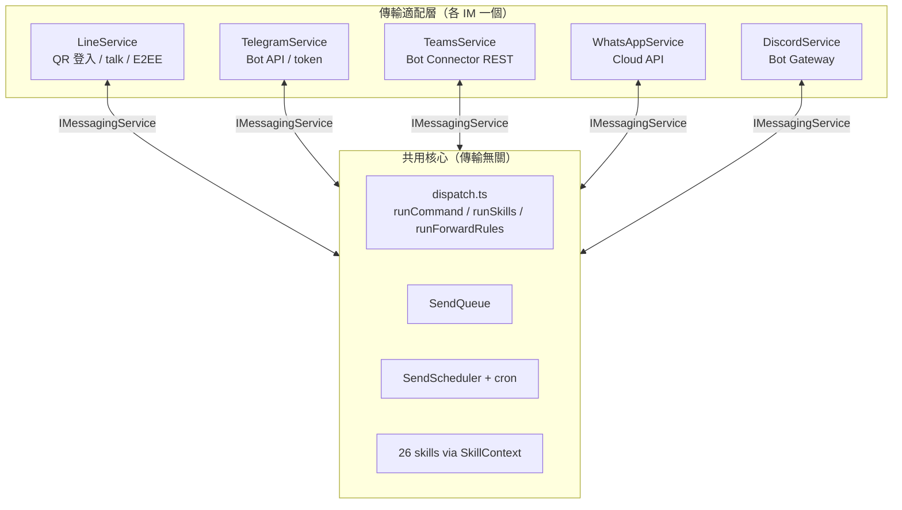

# 多通訊軟體支援規劃（IM.md）

> 狀態：規劃中 → 實作順序 **Telegram → Teams → WhatsApp → Discord**
> 已定決策（2026-09-29）：首發 Telegram；LINE＋新平台**同時雙開**；
> 接收走 Webhook；第一版即開**完整技能**（26 個全上）。
> 傳送路由：`POST /webhook` 留給 LINE（向下相容），Telegram 用 `POST /webhook/tg`。

## 1. 背景

本專案原本只支援 LINE（且是 selfbot：`@evex/linejs`＋QR 登入，非官方 API）。
好消息是真正值錢的幾層早就跟傳輸無關：

| 層 | 狀況 | 處置 |
|---|---|---|
| 技能／指令／轉發（`runSkills`、`runCommand`、26 skills） | 傳輸無關 | 直接重用 |
| 佇列／排程／cron（`queue.ts`、`scheduler.ts`、`cron.ts`） | 通用 | 直接重用 |
| `LineService`（`client.ts`，1012 行） | 唯一強綁定層（QR 登入、`talk.sendMessage`、E2EE、`liff`、MID、好友/群組） | 拆出介面，變成 adapter 之一 |
| 名詞（`chat`／`fromMid`／`targets: name→mid`） | LINE 味 | 泛化成 `chatId`／`userId`，targets 按平台分組 |

## 2. 目標架構



### 2.1 `IMessagingService` 介面（`src/messaging/types.ts`）

```ts
interface IMessagingService {
  readonly platform: "line" | "telegram" | "teams" | "whatsapp" | "discord";
  init(): Promise<void>;
  healthCheck(): Promise<boolean>;
  recover(): Promise<boolean>;
  sendAdvanced(inputs: SendInput[]): Promise<void>;
  schedule(inputs: SendInput[], runAt: number, repeat?: string): ScheduledJobView;
  updateScheduled(id: string, patch: {...}): ScheduledJobView | null;
  listScheduled(): ScheduledJobView[];
  cancelScheduled(id: string): boolean;
  listTargets(): Array<{ name: string; id: string }>;
  refreshContacts(): Promise<void>;
  getQueueStats(): { pending: number; running: boolean };
  stopListening(): void;
  stopQueue(): void;
}
```

`server.ts`、`monitor/token.ts`、`index.ts` 改吃此介面；`LineService implements IMessagingService`。
`SendInput` 沿用（8 種：text/image/video/audio/file/sticker/location/flex），各 adapter 自行降級不支援的型別。

### 2.2 dispatch 抽離（`src/messaging/dispatch.ts`）

把 `runCommand`／`runSkills`／`runForwardRules`＋助理前綴解析從 `LineService` 搬出，
改吃「發送函式」參數；`SkillContext.chat` 改為平台通用 ID（字串即可，相容）。
`fromMid` 語義改為 `userId`（型別不變，仍是字串）。

## 3. 各平台實作計畫

### 3.1 Telegram（Phase 1，本輪實作）

> 進度：Phase 0（IMessagingService 抽象、dispatch 抽離、服務註冊表）**已完成**；
> Phase 1（`src/telegram/client.ts`、`/webhook/tg`、`/tg/update`、設定頁卡片、dashboard 分平台狀態、正規化測試）**已完成**。

- **認證**：Bot token（BotFather），無 QR；**零新依賴**，直接 `fetch` 打 Bot API。
- **發送**：`sendMessage`／`sendPhoto`／`sendVideo`／`sendAudio`／`sendDocument`／`sendLocation`；
  降級：Flex → altText 文字；LINE 貼圖 → 文字說明；本地檔走 multipart。
- **接收**：`POST /tg/update`，驗 `X-Telegram-Bot-Api-Secret-Token`，轉 `IncomingMessage` 後走共用 dispatch。
- **發送路由**：`POST /webhook/tg`（驗證沿用 HMAC/Token/scope 機制）。
- **設定**：`telegram: { enabled, botToken(secret), secretToken, tgTargets }`＋設定頁卡片；dashboard 狀態分列。
- **啟動**：有 public URL 則自動 `setWebhook`，否則 log 提示手動設定。
- **測試**：adapter 正規化單元測試（mock fetch）＋沿用既有 141 測試＋真 bot 端到端（需測試用 token）。

### 3.2 Teams（Phase 2，待帳號資源）

- **前置（使用者側）**：Azure 訂閱 → Azure Bot resource（Entra App ID＋client secret，**single-tenant**；
  multi-tenant 新建已停用）→ M365 tenant 開 sideloading → Teams app package。
- **實作**：`src/teams/client.ts`（`TeamsService`），**不引 Bot Framework SDK**（已歸檔，2025-12-31 終止支援），
  直接 REST：Entra client-credentials 取 token（快取）→ POST `serviceUrl`；
  好消息：**Adaptive Card ≈ Flex**，現有 Flex 樣板可轉譯（不像 TG 只能降級）。
- **接收**：`POST /teams/messages`，驗 Bot Connector Bearer JWT（微軟公開金鑰驗簽＋audience＝App ID）。
- **主動推播**（排程/到價用）：存 conversationReference 走 proactive message 流程。
- **驗收**：typecheck＋build＋全測試＋真 Teams 來回（需 tenant）。
- **風險**：SDK 歸檔（以 REST 直連迴避）、Teams 訊息/卡片大小限制（長文沿用切段機制）、
  sideloading 僅限自有 tenant（全公司散佈需走 Teams Store，另案）。

### 3.3 WhatsApp（Phase 3）

- **前置**：Meta Business 帳號＋企業驗證、專用電話號碼（不可綁個人號）、WABA；
  **費用**：Cloud API 本體免費，但 business-initiated 訊息按模板類別逐則收費（另加 BSP 費用，視供應商而定）。
- **實作**：`src/whatsapp/client.ts`，Cloud API REST（發送）＋ webhook（接收，驗 `X-Hub-Signature-256`），形狀與 Telegram adapter 高度相似。
- **關鍵限制（影響排程設計）**：**24 小時視窗**——用戶最後訊息 24 小時內可自由回覆；超過需用**預審模板**。
  到價通知／晨報這類主動推播必須走模板＋預算控管；`ctx.watch` 推播到 WA 時需標記模板。
- **驗收**：同上，另加模板發送測試。

### 3.4 Discord（Phase 4）

- **前置**：Discord Developer Portal 建 Bot（token），開 MESSAGE_CONTENT intent。
- **實作**：`src/discord/client.ts`，Gateway WebSocket 收訊（或 interactions webhook）、REST 發送；
  Embed ≈ Flex 簡版可轉譯。
- **驗收**：同上。

## 4. 共通路由與設定命名

| 用途 | LINE（既有） | Telegram | Teams | WhatsApp | Discord |
|---|---|---|---|---|---|
| 發送 | `POST /webhook` | `POST /webhook/tg` | `POST /webhook/teams` | `POST /webhook/wa` | `POST /webhook/discord` |
| 接收 | 長連接（自 bot） | `POST /tg/update` | `POST /teams/messages` | `POST /wa/webhook` | Gateway |
| 目標對照 | `targets` | `tgTargets` | `teamsTargets` | `waTargets` | `discordTargets` |

## 5. 風險總覽

1. LINE 是 selfbot（QR 登入、違反 ToS 有停權風險），其餘全是官方 Bot——兩套 auth／狀態機並存，登入頁只顯示 LINE QR。
2. 平台能力差異（Flex／貼圖／模板／24h 視窗）一律「降級＋寫進 README」，不假裝支援。
3. `POST /webhook` 的驗證與 scope 機制各平台共用，不另起爐灶。
