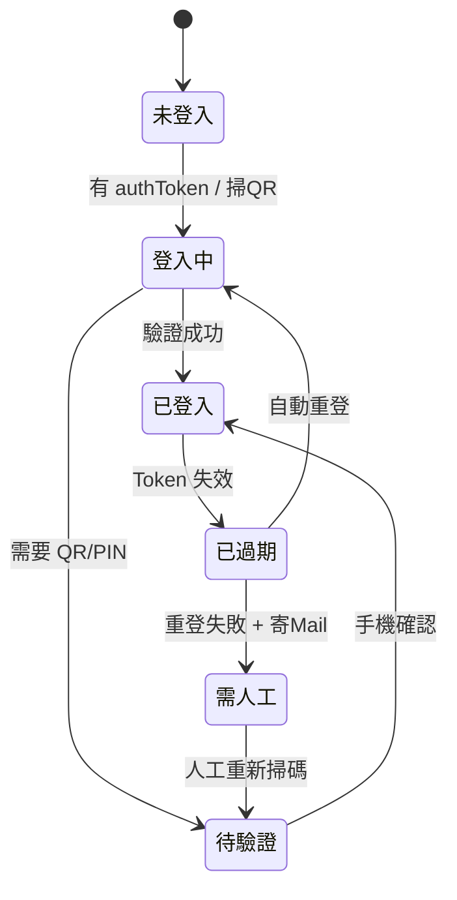

# LINE Webhook 轉發器 — 架構

將外部端點傳來的訊息，透過一個已登入的 LINE 帳號（selfbot）轉發給指定的好友或群組。

> 注意：使用非官方 LINE API（linejs）屬 selfbot，違反 LINE 服務條款，帳號有被停權風險。

## 技術選型

- 語言：TypeScript + Node.js
- LINE 用戶端：`@evex/linejs`（JSR）
- Webhook / 狀態頁：Express 或 Fastify（單一 process、單一 port 不同路由）
- Email 通知：`nodemailer`
- 對外通道：ngrok 或 Cloudflare Tunnel

## 系統流程圖

```mermaid
flowchart TD
    subgraph Boot["① 啟動階段"]
        A[讀取 config<br/>port / 允許IP / HMAC密鑰 / SMTP / 帳號] --> B{有有效 authToken?}
        B -- 有 --> C[登入 LINE 帳號]
        B -- 無 / 過期 --> D[產生 QR / PIN<br/>顯示於 console]
        D --> C
        C --> E[抓好友/群組<br/>建立 mid 對照表]
        E --> F[啟動 Webhook :8090]
        E --> G[啟動 狀態頁 :8090/status]
        E --> H[啟動 Token 健康監控]
    end

    subgraph Webhook["② 接收 / 轉發"]
        W1[收到 POST] --> W2{來源 IP 允許?}
        W2 -- 否 --> W9[403 + log]
        W2 -- 是 --> W3{驗證 (HMAC / URL Token / Bearer)?}
        W3 -- 否 --> W9
        W3 -- 是 --> W4[解析 to / 訊息內容 / 模板+變數 / 排程]
        W4 --> W5{找到目標 mid?}
        W5 -- 否 --> W10[404 + log]
        W5 -- 是 --> W6[getChat mid .sendMessage]
        W6 --> W7{發送成功?}
        W7 -- 是 --> W8[200 + log]
        W7 -- 否 --> W11[重試 → 500 + log]
    end

    subgraph Monitor["③ Token 監控（定時）"]
        M1[檢查登入狀態] --> M2{Token 有效?}
        M2 -- 是 --> M3[狀態頁: 綠燈 正常]
        M2 -- 否 --> M4[嘗試自動重登]
        M4 --> M5{重登成功?}
        M5 -- 是 --> M3
        M5 -- 否 --> M6[寄 Email 通知]
        M6 --> M7[狀態頁: 紅燈<br/>顯示 QR / PIN]
    end

    subgraph Status["④ 狀態頁 :8090/status"]
        S1[登入狀態 + 最後發送時間]
        S2[最近 log 列表]
        S3[正常綠燈 / 過期紅燈 + QR]
    end

    F --> W1
    H --> M1
    G --> Status
    M3 --> Status
    M6 --> Status
```

## 登入狀態機



## Webhook 介面

### 請求

```http
POST /webhook HTTP/1.1
Content-Type: application/json
X-Signature: <HMAC-SHA256(body, secret)>   # 或 ?token=<WEBHOOK_TOKEN> / Authorization: Bearer <API_TOKEN>

{
  "to": "好友名稱或 mid",           // 或陣列
  "text": "要轉發的訊息",            // 可選
  "template": "模板名稱",            // 可選（搭配 vars）
  "vars": { "name": "小明" },        // 可選
  "sticker": { "packageId": "446", "stickerId": "1988" },  // 可選
  "location": { "latitude": 25.03, "longitude": 121.56 },  // 可選
  "flex": { "altText": "通知", "contents": { "type": "bubble" } }, // 可選
  "sendAt": "2026-01-01T09:00:00+08:00",  // 可選（或 delaySec）
  "delaySec": 60                          // 可選
}
```

### 回應

| 狀態碼 | 意義 |
| --- | --- |
| 200 | 發送成功 |
| 400 | 參數格式錯誤 |
| 403 | 來源 IP 不在允許清單，或 HMAC 簽章錯誤 |
| 404 | 找不到目標好友 / 群組 |
| 500 | LINE 發送失敗（已重試） |

## 狀態頁

- 路由：`GET /status`（與 webhook 同一個 process / port）
- 顯示內容：
  - 登入狀態（綠燈正常 / 紅燈過期）
  - 過期時顯示 QR / PIN 供人工重新驗證
  - 最後一次發送時間與目標
  - 最近 N 筆 log（時間、來源 IP、目標、成功/失敗、錯誤原因）

## Email 通知

- 觸發時機：登入狀態由「正常 → 過期」時寄送一次（狀態去重，避免重複轟炸）
- 內容：目前登入狀態、需人工處理提示、狀態頁連結
- SMTP 設定放於 config

## 注意事項

- **登入不可省**：核心是已登入的 LINE client；`authToken` 過期須能自動重登，否則轉發會靜默失敗。
- **狀態回饋**：webhook 需同步回傳實際發送結果，呼叫方才能判斷成敗。
- **目標解析**：好友名稱可能重複，建議優先使用 `mid`；支援名稱時需處理「找不到 / 多筆」。
- **安全性**：IP 白名單可被偽造/共用，建議搭配 HMAC 簽章驗證。
- **重試**：LINE 發送遇暫時性錯誤應重試，並記錄於 log。

## 多平台（IM）支援

### 傳輸抽象層

- `src/messaging/types.ts`：`Platform`、`IMessagingService`、`IncomingMessage`、`ChatTarget`。
- `src/messaging/services.ts`：服務註冊表（`registerService` / `getService` / `listServices`）。
- `src/messaging/dispatch.ts`：共用的收訊管線（指令 → 技能 → 轉發規則），吃 `DispatchDeps`。
- 各平台 adapter（`src/line/client.ts`、`src/telegram/client.ts`…）實作 `IMessagingService`，
  只負責傳輸；`index.ts` 在啟動時 `registerService()`。

### 平台歸屬對照表（顯示與設定分離的依據）

> 規則：**只有某個 IM 才用得到的設定/UI，一律標 `data-im="<平台>"`**；共用者不標。
> 設定頁、Console、Dashboard 都靠 `[data-im]` + 右上角全域切換（localStorage `lw_platform`）自動過濾。

| 歸屬 | 設定欄位 / UI |
| --- | --- |
| **共用** | 安全/來源（allowedIps、hmac*、webhookToken*、apiToken*、adminPrivateOnly、rateLimit*）；發送/重試（send.*、replyMaxChars）；監控/Log（timezone、healthCheckIntervalSec、log*、messagesPersist）；訊息模板 `templates`（純文字）；訊息轉發規則 `forward`；指令 `commands`；Email `smtp.*`；匯出/匯入；語言；技能頁 `assistant` + `skills`；Console 的測試發送、目標清單、最近紀錄、排程；Dashboard 的狀態摘要與發送統計 |
| **LINE 專屬** | 設定：`line.device` / `deviceName` / `modelName`、`targets`（mid）、**Flex 樣板 `flexTemplates`**；Console：Flex 可視化編輯器、操作（重新登入 / 重新整理聯絡人）；Dashboard：QR / PIN |
| **Telegram 專屬** | 設定：`telegram.enabled` / `botToken` / `secretToken` / `webhookUrl` / `telegram.targets`（chat_id） |
| **WhatsApp 專屬** | 設定：`whatsapp.enabled` / `mode`（cloud\|web）/ `phoneNumberId` / `accessToken` / `verifyToken` / `appSecret` / `apiVersion` / `webAuthPath` / `whatsapp.targets`（E.164）。Cloud 走 `/wa/webhook` + Meta 驗簽；web（個人帳號）走長連線、無 webhook |
| **Teams 專屬** | 設定：`teams.enabled` / `appId` / `appPassword` / `tenantId` / `serviceUrl` / `teams.targets`（conversation id）。單一企業模式（無個人帳號選項）；接收 `POST /teams/messages`、驗 Bearer JWT；Flex 轉譯為 Adaptive Card |

判準：看該值被**哪個 adapter** 消費。例如 `flexTemplates` 只有 LINE 用得到（Telegram 會降級成 altText），故為 LINE 專屬；`templates` 送出前已轉成文字，故共用。

### 新增一個 IM 的檢查清單

1. **型別 / 服務**：`Platform` union 加新平台；新增 `src/<im>/client.ts implements IMessagingService`；`index.ts` 依設定 `registerService()`。
2. **設定管線**：`src/config.ts`（env + `Config`）、`src/settings.ts`（schema / `currentSettings` / `apply` / `loadSettings` merge）各加一份 `<im>` 區塊。
3. **路由**：發送端點 `POST /webhook/<im>`（用 `makeWebhookSender(() => getService("<im>"))`）；接收端點依平台驗證方式實作。所有管理用路由改用 **`serviceFor(req)`**（依 body 的 `platform` 解析），**切勿寫死 `line`**。
4. **設定頁**：新增 `fieldset[data-fn="<im>"][data-im="<im>"]` 與側欄卡片；共用欄位不標 `data-im`。
5. **Console / Dashboard**：在頁面的 `platforms` 陣列加一項；`[data-im]` 與右上角切換自動生效（Console 的 `applyConsoleImVisibility`、Dashboard 的 `selected` 過濾）。
6. **統計**：所有 `recordSend` 帶 `platform`；`SendEvent.platform` 未標記者視為 `line`（相容舊資料）。
7. **測試**：adapter 正規化單元測試 + 路由驗證測試；跑 `npm run typecheck && npm run build && npm test`。

